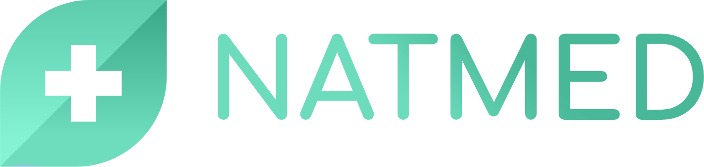
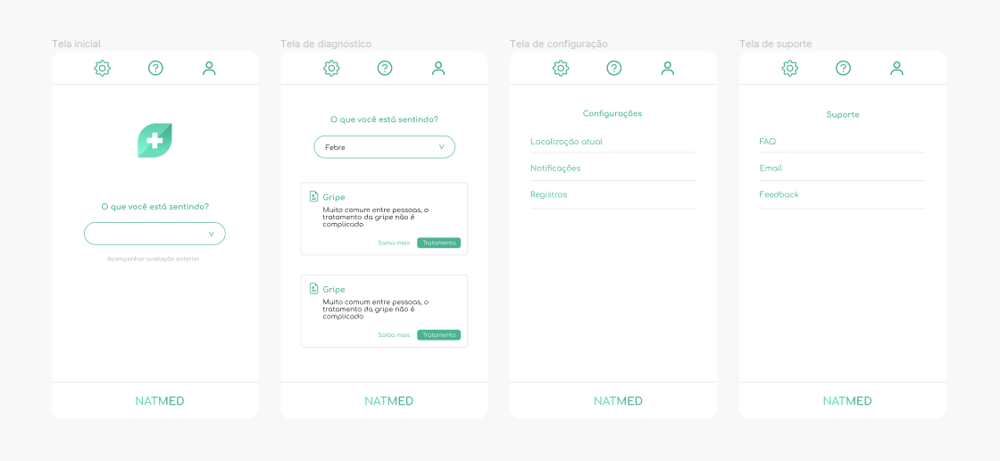

  

  

  Diagnose symptoms in less than a minute and receive natural treatments.

 

## Pitch

In the old days, when we didn't have access to hospitals and doctors, what supported us was the knowledge of the older people, the elders, the communities with their recipes and natural treatments.

Today, with the help of science, we can do research and prove the effectiveness of these natural treatments, but obtaining medical care and diagnoses remains a time-consuming and bureaucratic process.

To solve this problem, we created Natmed: an application that uses artificial intelligence and machine learning to combine symptoms and provide diagnoses in less than a minute.

## Prototype

  

## Licence

All rights are reserved to the founders of the company, creators of the ideas and documents. This material must not be reused in any way without the express opinion of all founders.
