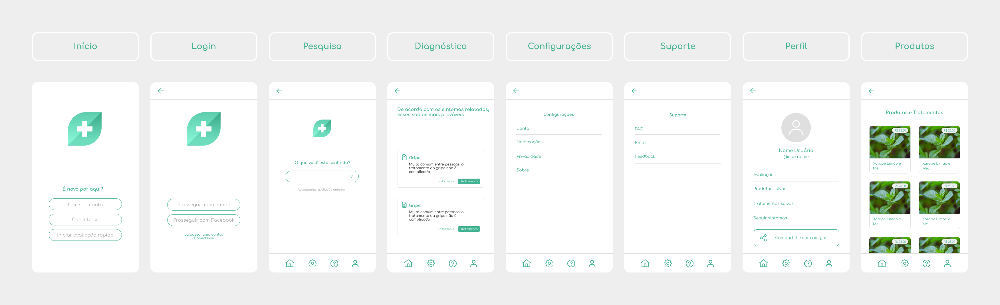

  

  

  Uma aplicação que diagnostica sintomas e fornece tratamentos com medicina natural.

 

## Protótipo

  

## Embalagem de Produto

  

## Pitch Inicial

Estamos em uma época muito urgente para a área da saúde, e apesar do mundo inteiro estar juntando esforços, ainda há muito a ser feito. 

É comum, mesmo isso sendo incômodo, que precisemos nos organizar e nos deslocar até os médicos locais para consultar ou tratar algum problema de saúde.

Mas a verdade é que, boa parte dos procedimentos poderiam ser feitos a distância, e ainda outros poderiam ser realizados pelo profissional em domicílio.

Num mundo modernizado que estamos, com necessidade de distanciamento e problemas de mobilidade, por que não podemos solicitar um médico como solicitamos uma entrega?

Assim como refeições, remédios ou mesmo carros podem ser comprados ou alugados com alguns cliques, especialistas da área da saúde também deveriam ser.

É isso o que fazemos, nós lapidamos a área médica para que a mesma atenda ao mundo moderno, seja a distância, ou mesmo em domicílio.

## Questionários

Nós realizamos dois questionários iniciais para o projeto.

  
Questionário 01

  
  1) Eu sou:

  - a) Empresário;
  - b) Comerciante;
  - c) Funcionário
  - d) Outro: (descrever)

  2) Quantos funcionários em média a sua empresa possui?

  3) Qual é o seu ramo de atuação ?

  4) Quanto tempo você está nesse ramo?

  5) O que mudou na rotina da empresa com o início da pandemia?

  6) Como é feita a verificação dos funcionários ou clientes se eles estão usando máscaras ou algum outro EPI obrigatório?

  7) Existe algum processo na empresa que você gostaria que fosse automatizado? Qual?

  8) Existe alguma fiscalização durante o expediente para verificar se as pessoas estão utilizando máscara e/ou equipamento de proteção?

  9) Você já investiu alguma vez em uma tecnologia que visasse melhorar algum processo da empresa? Se sim, qual foi a sua experiência?

  10) Você pretende investir em alguma tecnologia que automatize o monitoramento do funcionário durante o expediente?

  
Questionário 02

  
  - Qual exame é o mais procurado por pacientes?

  - Sobre o que os pacientes e você (médico) sentem mais dificuldade quando vão fazer o exame?

  - Quantos exames em média é preciso para para diagnosticar uma doença?

  - Quanto tempo em média leva para ter um diagnóstico geral sobre a condição do paciente?

  - Na relação entre médico e paciente, o que poderia ser melhor? Existe espaço para a tecnologia nisso?

  - Existe alguma coisa que poderia ser facilitada ou automatizada com relação ao atendimento, exames, diagnósticos ou documentos?

  - Em geral, os pacientes buscam atendimento médico em que nível de sintomas, leves, moderados ou graves?

  - Quando o paciente demora a buscar atendimento médico, quais os principais fatores que você acha que são responsáveis pela demora?
  

## Canvas do Modelo de Negócio

| Seção  |  Descrição  |
| :--- | :--- |
|  Parcerias chaves |  Médicos e naturalistas, farmácias, clínicas públicas e privadas, empresas e lojas de produtos naturais, profissionais que trabalham com a saúde do corpo e da mente |
|  Atividades chaves |  Desenvolvimento de software, aprendizado de máquina, coletânea de produtos naturais e suas aplicações, parcerias com profissionais e empresas da saúde |
|  Proposta de valor |  Analisamos sintomas e fornecemos tratamentos naturais para pacientes em menos de um minuto |
|  Recursos chaves |  Equipe de desenvolvimento, equipamento de tecnologia, contas em stores de celular para os aplicativos, médico com conhecimento da área, profissionais e conteúdo da área da saúde corporal e mental |
|  Relações com clientes |  Divulgação através de facebook, instagram, whatsapp. Atendimento de primeiro nível nessas três redes. Suporte ao sistema por email ou whatsapp. Criação de conteúdo na área da saúde. Comunicação/marketing com clientes através de parcerias |
|  Canais |  Conversas pessoais com os responsáveis das lojas de produtos naturais e clínicas. Exposições, propaganda em revistas, redes sociais e eventos sobre saúde |
|  Segmentos de mercado |  Todos inclusos na área médica, que fornecem serviços ou precisam deles, sejam proprietários, funcionários ou pacientes, que tenham interesse em tratamentos naturais |
|  Estrutura de custos |  Desenvolvedores, servidor, aplicativo, website, marketing |
|  Fontes de renda |  Porcentagem por produto vendido ou tratamento contratado |

## Landing Page

O link para a landing page de lançamento do aplicativo está disponível [neste link](http://everaldo332-rdsm-site.rds.land/natmed).

## Cap Table e Diluation Table

Nós acordamos em grupo que o cap table seria uma porcentagem igual entre os membros.

Assim sendo, no time composto por seis membros, temos o cap table de 16,6% para cada.

No diluation table, concordamos em também realizar a diluição das porcentagens de forma igual.

Ou seja, ao investidores entrarem, a diluição de capital será igual para todos os membros fundadores.
